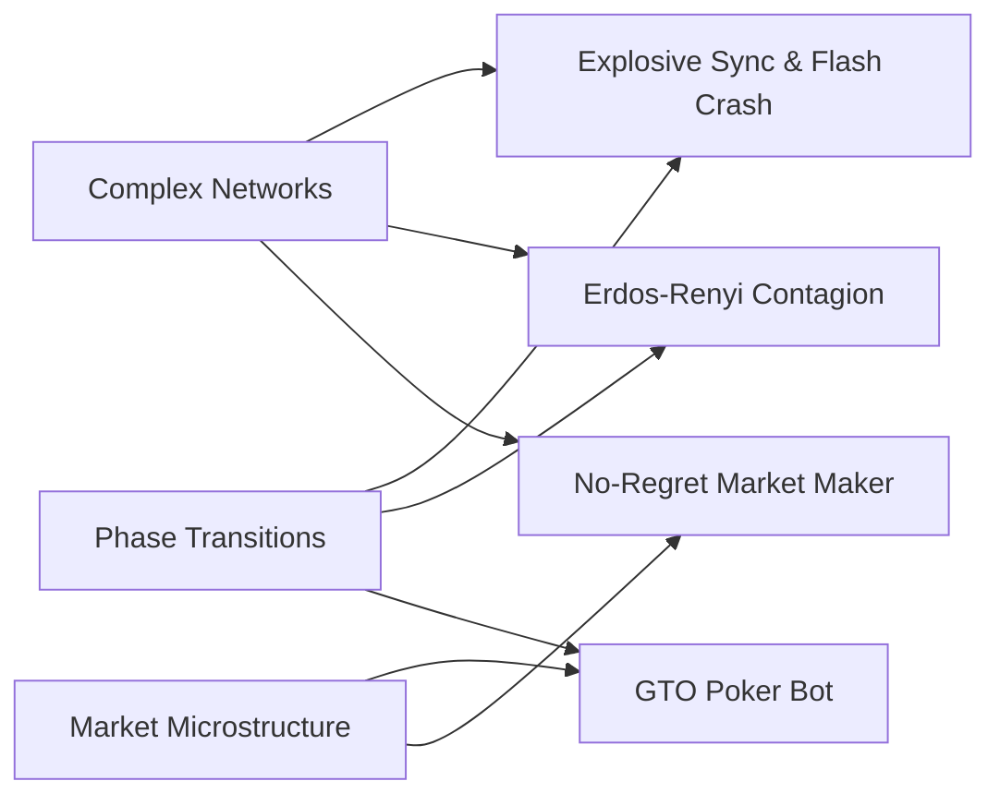
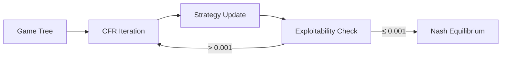
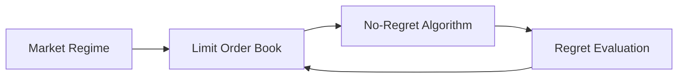
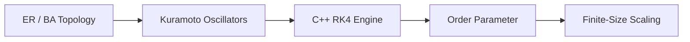
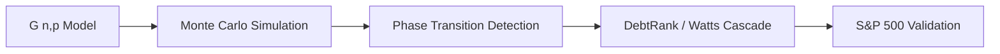

<div align="center">


<br/>

[](https://github.com/Athmeeya2006)

<br/>

[](https://athmeeya2006.github.io/webpage/)
[](https://linkedin.com/in/athmeeya-kashyap)
[](https://codeforces.com/profile/athmeeyakashyap)
[](mailto:athmeeyakashyap@gmail.com)

</div>

<br/>

```
athmeeya@iiit-h:~$ whoami
Second-year dual degree (B.Tech CS + MS CNS) @ IIIT Hyderabad
Undergraduate Researcher @ CCNSB Lab

athmeeya@iiit-h:~$ cat research.txt
complex_networks   phase_transitions   financial_contagion

athmeeya@iiit-h:~$ ./achievements --list
INMOTC 2022 ................. 1 of 22 from Karnataka, ICTS-TIFR Bengaluru   [OK]
INMO Qualifier 2022 ......... Top 300 nationally                            [OK]
NSEA 2023 ................... Top 1% statewide, IAPT                        [OK]
SGFI Nationals .............. Karnataka Swimming, Breaststroke 200m         [OK]

athmeeya@iiit-h:~$ ls projects/
GTO_Poker_Bot/   No-Regret-Market-Maker/   Explosive-Sync-Flash-Crash/   Erdos-Renyi-Contagion/
```

<div align="center">


</div>

---

## Research Architecture



---

## Projects

### [GTO Poker Bot](https://github.com/Athmeeya2006/GTO_Poker_Bot)

Four CFR-family solvers (Vanilla CFR, CFR+, DCFR, MCCFR) computing Nash-approximate strategies across Kuhn and Leduc Poker. Exploitability below 0.001 chips/game within 10k iterations. Maps CFR bluff frequency to Glosten-Milgrom adverse selection spread via the informed-trader/bluffer isomorphism.

> **Key result:** Exploitability below 0.001 chips/game within 10k iterations




---

### [No-Regret Market Making Engine](https://github.com/Athmeeya2006/No-Regret-Market-Maker)

C++17 limit order book with price-time priority, exposed to Python via pybind11. Benchmarks 6 no-regret algorithms across 10,000-round simulations in 4 market regimes. Empirical regret stays below the O(sqrt(TK ln K)) bound across all runs.

> **Key result:** Empirical regret below O(sqrt(TK ln K)) bound across all runs




---

### [Explosive Synchronization & Flash Crash](https://github.com/Athmeeya2006/Explosive-Sync-Flash-Crash)

Kuramoto and Stuart-Landau oscillator dynamics on ER and BA topologies. Custom C++17 RK4 engine runs 30x faster than SciPy adaptive solvers. Finite-size scaling across N = 50 to 800 recovers theoretical K_c to within 2%.

> **Key result:** 30x faster than SciPy adaptive solvers, K_c recovered to within 2%




---

### [Erdos-Renyi Contagion](https://github.com/Athmeeya2006/Erdos-Renyi-Contagion)

Monte Carlo validation of G(n,p) phase-transition scaling laws across 10,980 simulation runs, extended to financial contagion via DebtRank, Watts cascades, and bond percolation. S&P 500 correlation network yields clustering Z-score above 30 sigma against 1,000 ER null graphs.

> **Key result:** Clustering Z-score above 30 sigma against 1,000 ER null graphs




---

## Stack

<div align="center">

[](https://skillicons.dev)

</div>

---

<div align="center">


*If everything seems under control, you're not going fast enough.*

</div>